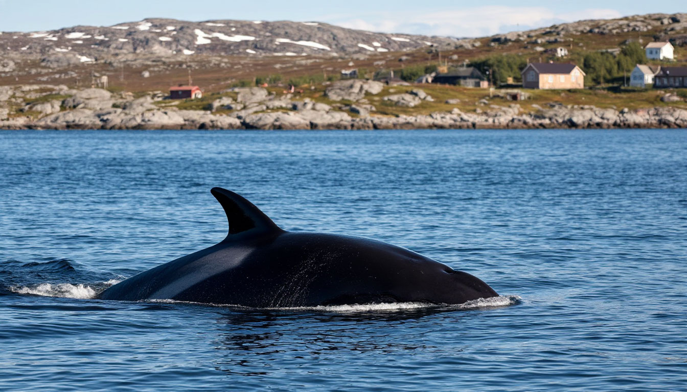
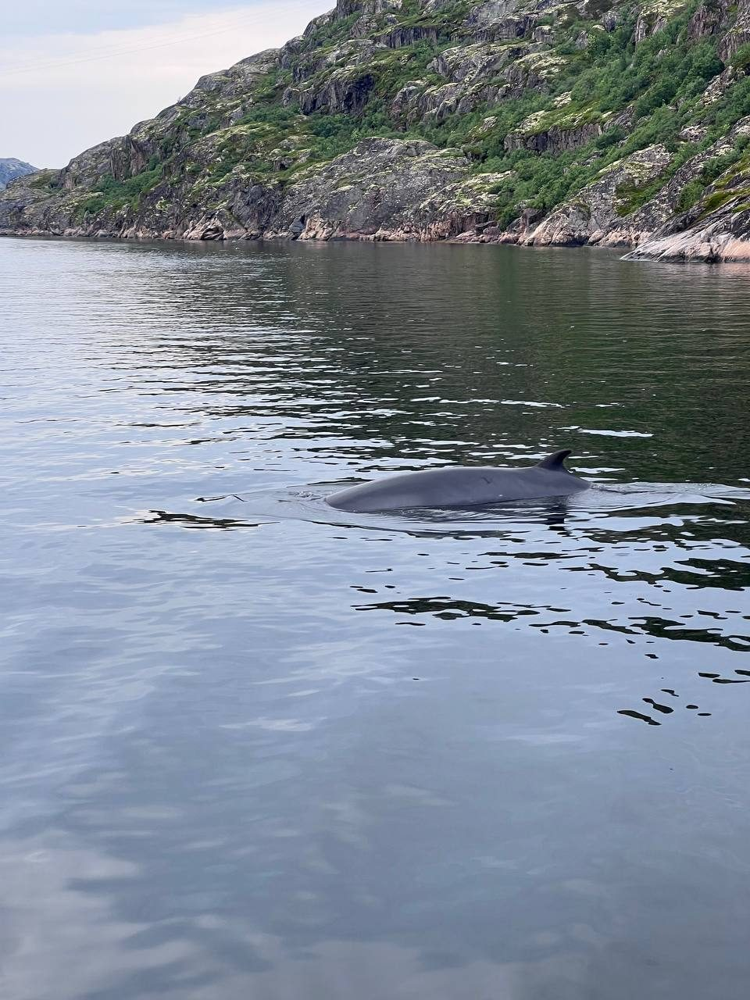
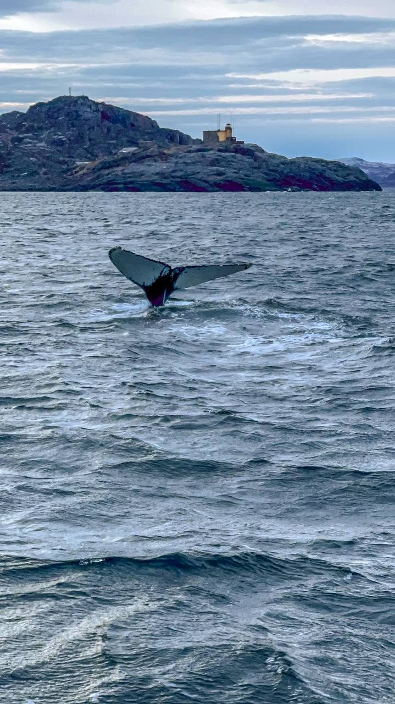
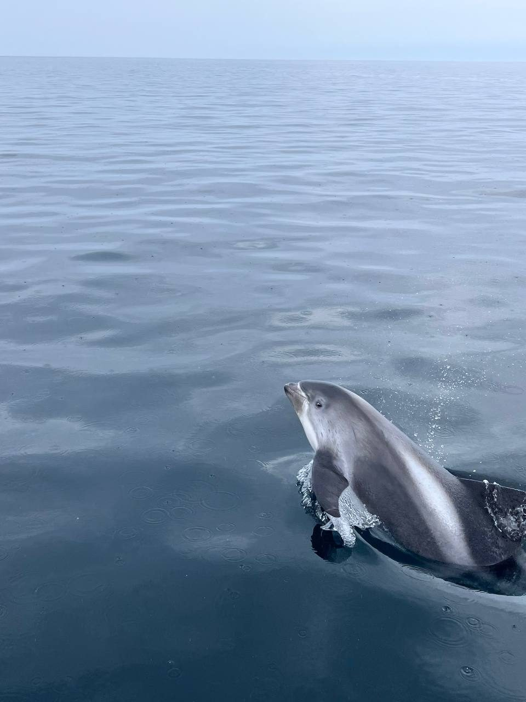
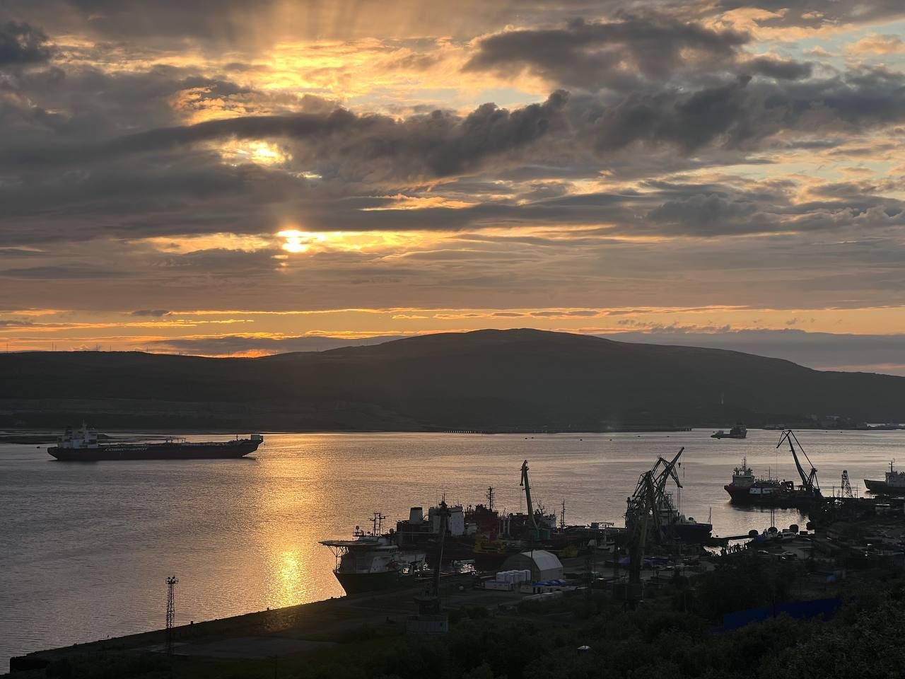
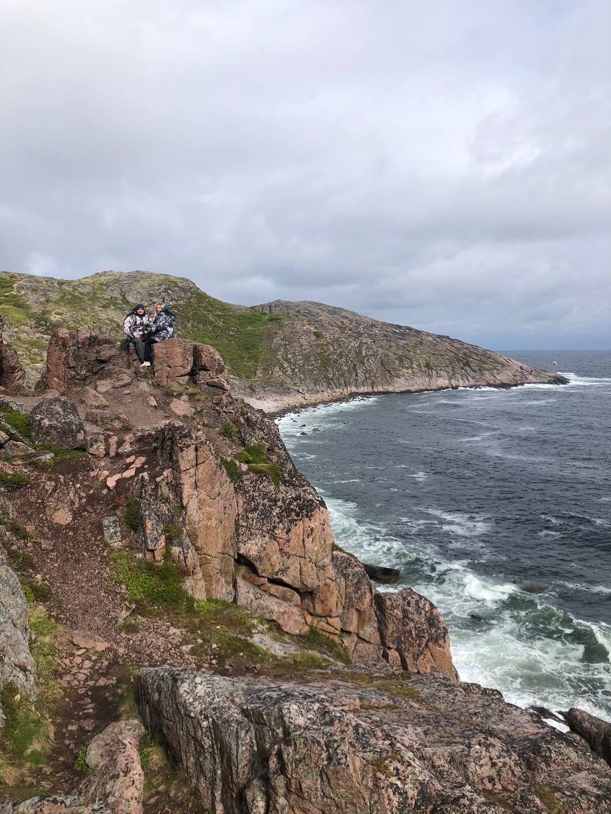

# Статья для блога: «Киты в Териберке»

> Черновик текстового материала для будущей страницы блога. Ниже — SEO-обвязка, готовый текст статьи с заголовками под поисковые запросы, фото обитателей (наши реальные снимки), FAQ (для микроразметки), внутренние ссылки и фотоплан.

---

## SEO-обвязка (для вёрстки страницы)

- **URL / slug:** `https://auroratrip.ru/blog/kity-v-teriberke.html`
- **Title (≤60 симв.):** `Киты в Териберке 2026: когда ехать и как увидеть | Aurora Trip`
- **Meta description (≤160 симв.):** `Когда в Териберке киты, каких можно увидеть и где искать. Сезон с мая по сентябрь, шансы встречи, цены на морскую экскурсию из Мурманска — от 4 500 ₽ с гидом.`
- **H1:** `Киты в Териберке: когда ехать, как их увидеть и как выбрать морскую экскурсию`
- **Основной запрос:** киты в Териберке
- **Дополнительные (fan-out) запросы, под которые заточен текст:** когда киты в Териберке · сезон китов в Териберке · какие киты в Териберке · как увидеть китов в Териберке · экскурсия к китам из Мурманска цена · морская прогулка Териберка киты · реально ли увидеть кита в Териберке · что взять на морскую экскурсию
- **Тип схемы на странице:** `Article` (BlogPosting) + `FAQPage` + `BreadcrumbList` (Главная → Блог → Киты в Териберке)
- **Дата:** опубликовано / обновлено — показывать на странице («Обновлено: …») для сигнала свежести.

---

## Текст статьи

### Киты в Териберке: когда ехать, как их увидеть и как выбрать морскую экскурсию

К китам под Мурманском выходят в море из нескольких точек — из **Териберки**, из **Ура-губы** и с полуостровов **Рыбачий и Средний**. Териберка — самая доступная и популярная: сюда проще всего добраться, и именно отсюда чаще всего организуют однодневные морские экскурсии. **Наблюдать китов можно с мая по сентябрь.** Стопроцентной гарантии не даёт никто: киты дикие, а погоду в Арктике не заказать. Но в сезон, с опытным капитаном, который знает места кормёжки, шансы встречи высокие.

Ниже — всё, что нужно знать перед поездкой: когда ехать, каких китов и морских обитателей реально увидеть, как проходит морская прогулка и сколько это стоит.

---

### Когда сезон китов в Териберке: по месяцам

Киты приходят к побережью Кольского полуострова вслед за рыбой — сельдью, мойвой, сайкой. Пока в Баренцевом море есть корм, есть и киты. Морские выходы проводятся в тёплый сезон, когда вода спокойнее и суда стабильно ходят.

| Месяц | Шанс встретить китов | Комментарий |
|---|---|---|
| Май | Средний–высокий | Старт сезона, рыба подходит к берегу, китов уже встречают |
| Июнь | Высокий | Много корма, активные киты, длинный полярный день |
| Июль | Высокий | Спокойное море, тёплая для Севера погода |
| Август | Высокий | Стабильные выходы в море |
| Сентябрь | Высокий | Меньше туристов, часто отличная видимость |

Сезон длится **с мая по сентябрь** — в остальные месяцы регулярных морских выходов к китам нет. Удачный кадр можно поймать в любой месяц сезона: люди едут именно ради того, чтобы увидеть и сфотографировать китов, и месяца «лучше для фото» здесь нет — важнее погода и удача.

---

### Кого можно увидеть в море

В акватории Баренцева моря у Териберки живёт богатый морской мир. Чаще всего туристы встречают китов, но выход в море почти всегда дарит встречу с кем-то из обитателей.

**Малый полосатик (минке)** — самый частый гость. Небольшой усатый кит с изогнутым спинным плавником, нередко подходит близко к судам.

**Горбатый кит (горбач)** — крупный кит, эффектно показывает хвост-«бабочку» перед глубоким нырком. Самый желанный кадр любого туриста.

**Беломордые дельфины** — быстрые и любопытные, идут за судном и выпрыгивают из воды. Встречаются целыми стаями.

Помимо них, в море можно увидеть:

- **Финвал (сельдяной кит)** — второе по величине животное на планете после синего кита, встречается реже.
- **Белухи** — белые полярные киты, иногда заходят группами.
- **Косатки** — редкая, но возможная встреча.
- **Морские свиньи** — самые маленькие китообразные наших вод.
- **Тюлени и морские зайцы** — крупные ушастые тюлени Баренцева моря, любопытно высовывают головы из воды у скал.

---

### Богатый мир птиц Баренцева моря

Побережье и острова у Териберки — это ещё и настоящий птичий рай. На прибрежных скалах гнездятся **птичьи базары**: тысячи птиц сидят ярусами на отвесных утёсах и наполняют воздух криком.

Здесь можно увидеть **моевок, кайр, чаек, бакланов, полярных крачек и гаг**, а на дальних мысах и островах — колонии морских птиц, за которыми специально едут фотографы и орнитологи. Во время морской прогулки птицы сопровождают судно почти всю дорогу, так что без кадров вы точно не останетесь.

---

### Где наблюдают китов: как проходит морская прогулка

Экскурсии к китам стартуют с побережья Баренцева моря — из Териберки, а также из Ура-губы или с Рыбачьего. Туристов сажают на **маломерное судно**, которое выходит из бухты в открытое море. До мест, где обычно встречаются киты, идти около **получаса**; там судно сбавляет ход, и начинается самое интересное — поиск.

Капитаны — местные, они знают, куда в этом сезоне подходит рыба, а за ней и киты. Кита сначала выдаёт **фонтан** — облачко водяного пара над водой, потом появляется тёмная спина или взмах хвоста. Вода в Баренцевом море холодная и часто с волной, поэтому выход в море — это всегда немного приключение.

---

### Как добраться до Териберки из Мурманска

Териберка находится примерно в **120 км** от Мурманска, дорога занимает около **2–2,5 часов** в одну сторону. Своей машины у большинства туристов нет, а рейсовый транспорт ходит редко и не подстроен под морские выходы. Поэтому самый простой вариант — **однодневная экскурсия из Мурманска с трансфером**: вас забирают из города, везут в Териберку, организуют морскую прогулку и возвращают обратно.

Такой формат экономит силы и снимает всю логистику: не нужно искать судно, договариваться с капитаном и следить за расписанием.

---

### Реально ли увидеть кита — честно о шансах

Главный вопрос всех туристов: **«А точно ли мы увидим кита?»** Честный ответ — никто не может обещать кита на 100%, и любой, кто обещает, лукавит. Киты — дикие животные, они перемещаются за кормом, а Арктика диктует свои условия по погоде и волне.

Но есть и хорошая новость: **в сезон, при выходе в море с опытным капитаном, шансы встречи высокие.** А если кита в этот день встретить не удастся, море, скалы, птичьи базары и сама атмосфера Баренцева побережья всё равно стоят поездки. Мы честно предупреждаем об этом заранее — чтобы ожидания совпали с реальностью.

---

### Что взять с собой на морскую экскурсию

**На воде почти всегда примерно в два раза холоднее, чем на суше** — ветер и брызги усиливают холод, поэтому даже в тёплый летний день на судне нужна тёплая непродуваемая одежда. Собираясь на морскую прогулку, возьмите:

- тёплую **непродуваемую куртку** и штаны, шапку и перчатки — даже в июле;
- **непромокаемую обувь** и дождевик на случай брызг и волны;
- **заряженный телефон или камеру** — кадры с китами получаются потрясающие;
- если склонны к укачиванию — **таблетки от морской болезни** заранее, за 30–40 минут до выхода в море.

Всё остальное для программы (трансфер, судно, сопровождение гида) в организованном туре уже включено.

---

### Что ещё посмотреть в Териберке

Поездку к китам логично совместить с главными локациями Териберки — всё рядом:

- **Кладбище кораблей** — деревянные остовы рыболовецких судов на берегу бухты, один из самых узнаваемых видов Русского Севера.
- **Батарейский водопад** — выпадает прямо из озера Малое Батарейское почти в море; к нему ведёт тропа вдоль скалистого побережья.
- **«Яйца дракона»** — гигантские круглые валуны на пляже, отшлифованные морем.
- **Качели у Баренцева моря** и арт-инсталляции — те самые кадры, ради которых Териберку полюбили после фильма «Левиафан».

За один насыщенный день можно увидеть и китов, и все ключевые точки Териберки.

---

### Как выбрать экскурсию к китам

При выборе тура обращайте внимание на три вещи: **местный ли гид** (он знает сезон и локации), **включён ли трансфер из Мурманска** (иначе логистика ляжет на вас) и **честно ли говорят о шансах** (обещания «100% кита» — тревожный сигнал).

Наш **[однодневный тур в Териберку на поиски китов](../page-kity-teriberka.html)** — это трансфер из Мурманска, выход в Баренцево море на поиски китов, местный гид и главные локации Териберки (кладбище кораблей, Батарейский водопад, «Яйца дракона») в одной программе. Стоимость — **от 4 500 ₽** с человека.

👉 [Посмотреть программу и забронировать тур к китам →](../page-kity-teriberka.html)
Остальные направления — в разделе [все экскурсии по Кольскому полуострову](../tury.html).

---

## FAQ (для видимого блока на странице + микроразметки FAQPage)

**Когда лучше ехать за китами в Териберку?**
Наблюдать китов можно с мая по сентябрь. Это весь сезон морских выходов; месяца «лучше остальных» нет — всё решают погода и удача, а увидеть и сфотографировать китов можно в любой месяц сезона.

**Каких китов и морских обитателей можно увидеть в Териберке?**
Чаще всего — малого полосатика (минке) и горбатого кита, реже — финвала. Также встречаются белухи, косатки, беломордые дельфины, морские свиньи, тюлени и морские зайцы. Вдобавок — птичьи базары с моевками, кайрами, бакланами и гагами.

**Реально ли увидеть кита в Териберке?**
В сезон при выходе в море с опытным капитаном шансы высокие, но стопроцентной гарантии не даёт никто — киты дикие, а погода в Арктике переменчива.

**Сколько стоит экскурсия к китам из Мурманска?**
Однодневный тур в Териберку с трансфером из Мурманска, морской прогулкой и местным гидом стоит от 4 500 ₽ с человека.

**Как добраться до Териберки из Мурманска?**
Териберка примерно в 120 км от Мурманска, дорога — около 2–2,5 часов. Удобнее всего ехать однодневной экскурсией с трансфером, чтобы не заниматься логистикой и поиском судна самостоятельно.

**Что взять с собой на морскую прогулку?**
На воде почти вдвое холоднее, чем на суше, поэтому нужна тёплая непродуваемая одежда, шапка и перчатки даже летом, непромокаемая обувь и дождевик, заряженная камера, а при склонности к укачиванию — таблетки от морской болезни.

---

## Фотоплан

Все имеющиеся фото — с наших выездов, что усиливает доверие (E-E-A-T) и даёт трафик из Яндекс/Google Картинок. Для каждого задать описательный `alt`.

### ✅ Фото, которые уже есть (вставлены в текст выше)

| Секция | Файл | Ориент. | Что на фото | alt |
|---|---|---|---|---|
| Hero | `images/teriberka_whales.jpg` | Гориз. | Кит у берега Териберки | «Кит у побережья Териберки в Баренцевом море» |
| Полосатик | `images/gallery/ter_3.jpg` | Верт. | Малый полосатик у скал | «Малый полосатик (минке) у скал Териберки» |
| Горбач | `images/gallery/ter_5.jpg` | Верт. | Хвост горбатого кита | «Хвост горбатого кита у Териберки» |
| Дельфины | `images/gallery/ter_4.jpg` | Верт. | Беломордый дельфин в прыжке | «Беломордый дельфин в Баренцевом море у Териберки» |
| Как добраться | `images/gallery/ter_1.jpg` | Гориз. | Кольский залив, порт Мурманска | «Кольский залив в Мурманске — старт пути в Териберку» |
| Что ещё посмотреть | `images/gallery/ter_2.jpg` | Верт. | Скалы над Баренцевым морем | «Скалистое побережье Териберки у Баренцева моря» |
| (доп.) Качели / трон | `images/gallery/ter_7.jpg`, `ter_8.jpg` | Верт. | Качели у моря; деревянный «трон» с хаски | «Качели у Баренцева моря в Териберке» |

### ⚠️ Фото, которых НЕТ в библиотеке — нужно прислать/доснять

Вставить в статью «фотографии всех обитателей» пока не могу физически: этих кадров у нас нет, а брать чужие из интернета нельзя (нарушение авторских прав + слабый сигнал для SEO). Нужны ваши реальные снимки:

- **Финвал (сельдяной кит)**
- **Белуха**
- **Косатка**
- **Морская свинья**
- **Тюлень / морской заяц**
- **Птичий базар** (моевки, кайры, бакланы, гаги) — для секции про птиц
- Желательно также: **фонтан кита крупным планом** и **туристы на борту судна** — усилят секции «морская прогулка» и «шансы»

Как пришлёте — вставлю их в соответствующие места (в тексте под каждый вид уже есть посадочное место).

---

## Заметки по внедрению
- Разместить под URL `/blog/kity-v-teriberke.html`, добавить в `sitemap.xml` (priority 0.7) и в навигацию блога.
- Добавить `Article` + `FAQPage` + `BreadcrumbList` JSON-LD (FAQ-текст выше уже совпадает с видимым блоком — политика Google соблюдена).
- Внутренние ссылки: с этой статьи → на `/page-kity-teriberka.html` (2+ раза) и `/tury.html`; обратно — со страницы тура кита поставить ссылку «Читать: когда ехать за китами».
- Обновить `llms.txt`: добавить статью в раздел «Полезно знать / Блог».
